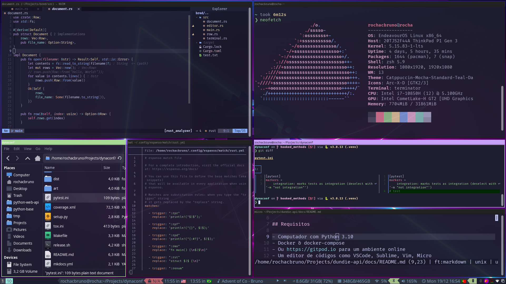

# Dotfiles


My Environment configurations featuring:

- 🐧 EndeavourOS - Arch Based Linux Distro
- 🌲 [i3 wm](guides/i3.md) - Window Manager 
- 🦀 i3 Status Rust - Bar and Tray icons
- 🐁 XFCE4 applets (for tray network and sound)
- 📷 Flameshot - Screenshot tool 
- ✏️  Gromit-mpx - Annotate on the screen
- 📂 Thunar - File manager with programmable actions
- 🚀 Rofi - Launcher for apps, emojis and more
- ⬆️  Espanso - O.S wide snippets
- 🖥️ Terminator - Terminal emulator
- 🖥️ ZSH - Terminal Framework
- 🦇 Bat - Replacement for cat 
- 🧭 Delta - Better git diff
- 😼 Hub - Add more commands to git
- 🚢 Starship - Terminal Line Emojis and cool status
- 🧬 Helix - A post modern terminal code editor
- 📁 lf - A terminal based file manager
- ⏲  hstr - A command history manager for terminal



## Requirements

Managed by [dotdrop](https://github.com/deadc0de6/dotdrop)

## Usage

Add a new file to be tracked by dotdrop

```bash
./dotdrop.sh import filepath
```

Update dotdrop repo after changes in the host system

```bash
./update.sh

# or ./dotdrop.sh update -f
# ./update.sh automates secrets hiding and some extra files
```

Compare repo with host system (or new system before install)
```bash
./dotdrop.sh compare
```

Install on a new host

```bash
./dotdrop install
```
