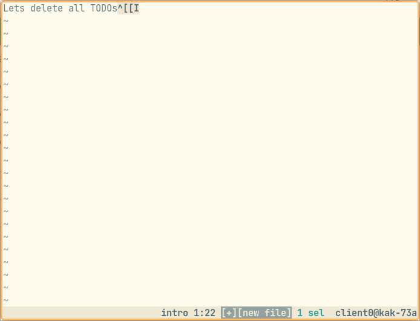

# kakoune-multi-file

Kakoune plugin to make changes across multiple files in a single buffer.



## Setup

Requirements:

- Python 3.6 or newer.

Use `plug.kak` to install:

```
plug "natasky/kakoune-multi-file"
```

## Workflow

### Collect lines to change

Use `grep` command to find points of interest across multiple files.

You can edit `*grep*` buffer to add or remove lines of interest.

**Tip**: if you just need make changes in those lines, use
[kakoune-find](https://github.com/occivink/kakoune-find)'s
`find-apply-changes -force` command.

**Tip**: if your compiler, linter or language server emits lines like
`<path>:<line>:`, its output can also be used to collect lines to change.

### Make changes in single buffer

Use `multi-edit-from-grep` command to collect lines and their sorrounding
context to a single editable buffer:

```
multi-file-from-grep [-A NUM] [-B NUM] [-C NUM]

optional arguments:
  -A NUM, --after NUM   Collect NUM lines after match, overrides --context.
  -B NUM, --before NUM  Collect NUM lines before match, overrides --context.
  -C NUM, --context NUM Collect NUM lines before and after match (default: 3).
```

For example, `multi-file-from-grep -A10` will collect 3 lines before every
result and 10 lines after. This command always collects lines from the current
buffer - usually you want to be in `*grep*` buffer for this.

This will open a `*multi-file*` buffer with contents like:

```
@@@ <path> <line>,<other details...> @@@
line 1
line 2
...
@@@ <path> <line>,<other details...> @@@
line 1
line 2
...
```

Each `@@@ ... @@@` line is a hunk header, followed by contents from files. Every
line from `grep` should have a corresponding hunk with sorrounding context.
Overlapping hunks are merged.

Make your changes to the contents of the hunks.

**Note**: don't modify hunk headers, these are required for applying the
changes. Deleting entire hunk (header and contents) is fine, and will leave
original contents unchanged when applying. Any modification to header will
prevent all changes to the file from applying.

**Tip**: it's sometimes hard to keep code tidy when editing multiple files, if
you use a code formatter you can neglect that and run it after applying changes.

### Optional: review changes

After making changes, you may use `multi-file-review` to review them. This will
open a new buffer with a unified diff of all changes without applying them. You
can repeat this step after making more changes to update the review buffer.

This step is optional, you can apply changes without reviewing them first.

### Apply changes

Use `multi-file-apply` to apply all changes. If nothing goes wrong, this will
close buffers opened in earlier steps. Otherwise you'll get a buffer with error
messages and no buffers will be closed.

**Note**: this step does _not_ use the review buffer if exists, it applies the
changes currently made in the `*multi-file*` buffer. If any change was made
since last review, it will also be applied.

## Notes

Like `grep`, this plugin works with files on disk. It's not aware of any buffers
currently opened in Kakoune. Make sure your changes in other buffers are saved
before starting (before running `grep`).

If a file was modified on disk after its contents were collected by
`multi-file-from-grep`, then `multi-file-apply` will refuse to apply any change
to it.

As with any action that modifies multiple files directly on disk, be sure to
check in any existing changes to source control before starting.

## Comparison with kakoune-find

`kakoune-find` is great for making changes directly in lines found by `grep`,
e.g. for renaming something. Prefer using it in those cases, as it involves
fewer steps.

This plugin lets you edit multiple lines around each result and add or remove
lines.

## Contributing

Bug reports, ideas for features and PRs are welcome!
