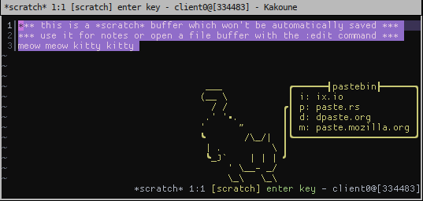

# Pastebin.kak
Paste to some pastebins through YOUR TEXT EDITOR

Install and setup 8D
```
plug 'uniquepointer/pastebin.kak' %{
    map global normal <a-y> ': enter-pastebin-mode<ret>' -docstring 'pastebin'
}
```
With those keybindings you simply select the text, do a-y and then you get the popup in the next image,
select the site you want to upload to, and then the url will be in your clipboard.


## Supported sites
* ix.io
* paste.rs
* dpaste.org
* paste.mozilla.org
