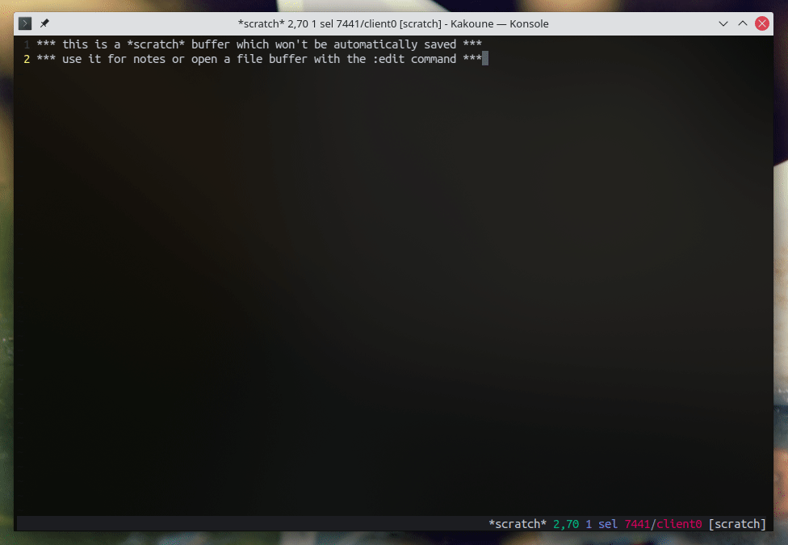
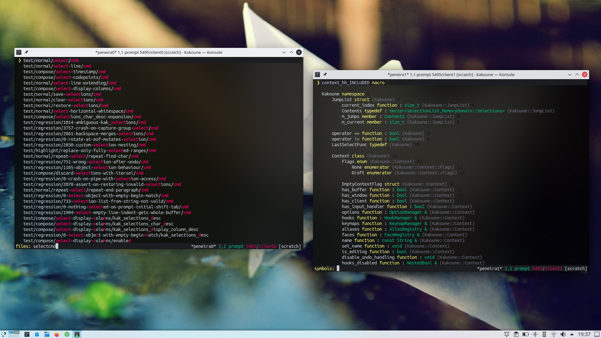
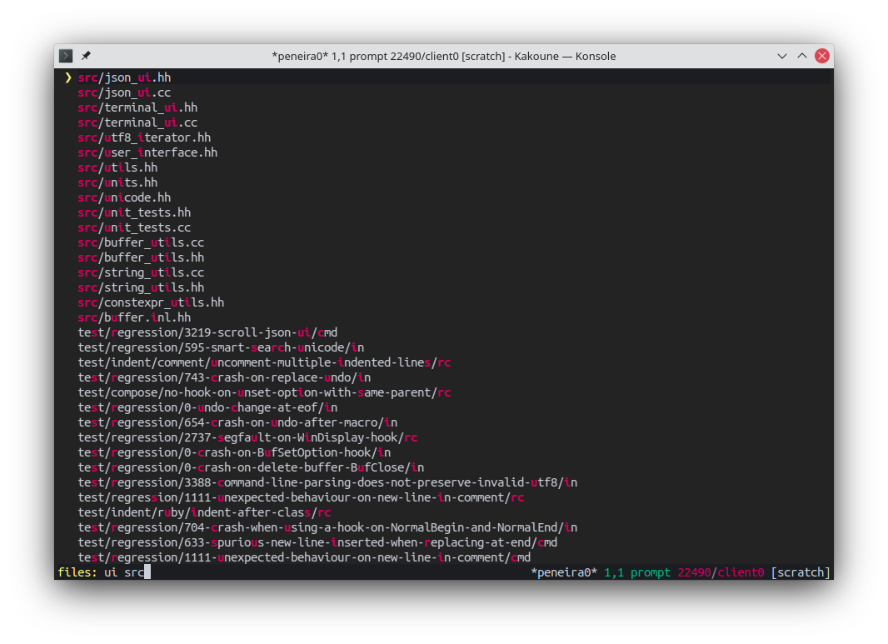
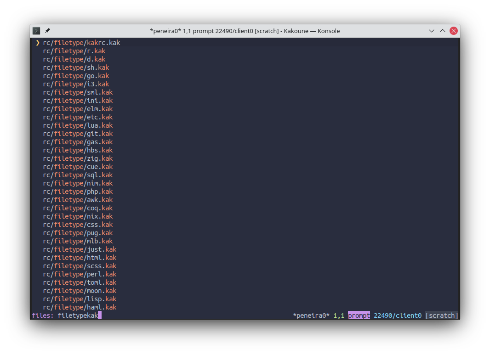
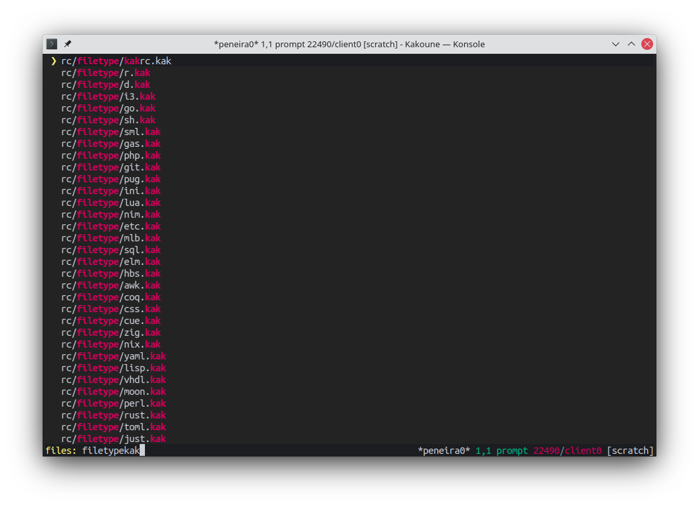
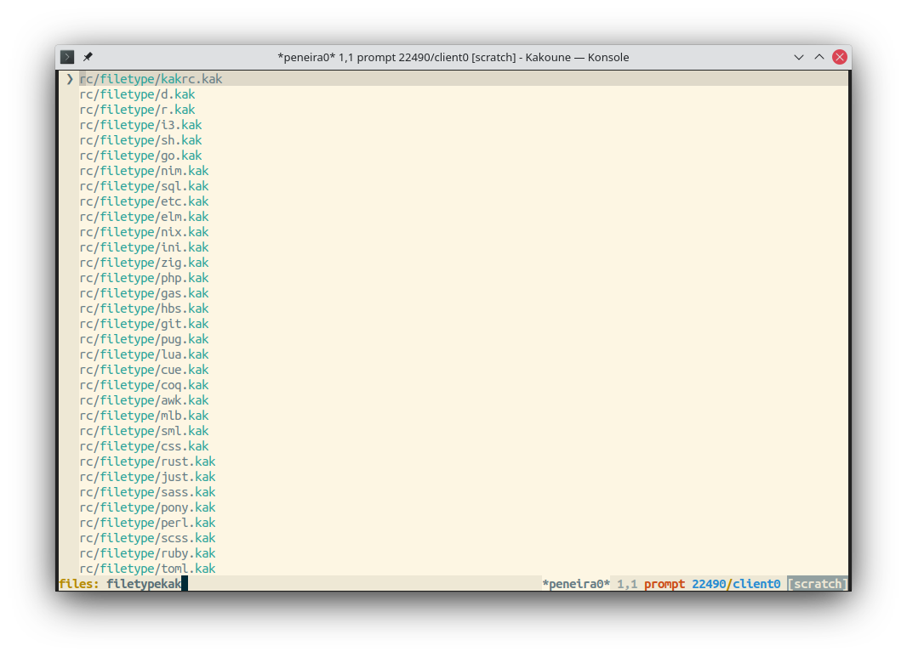
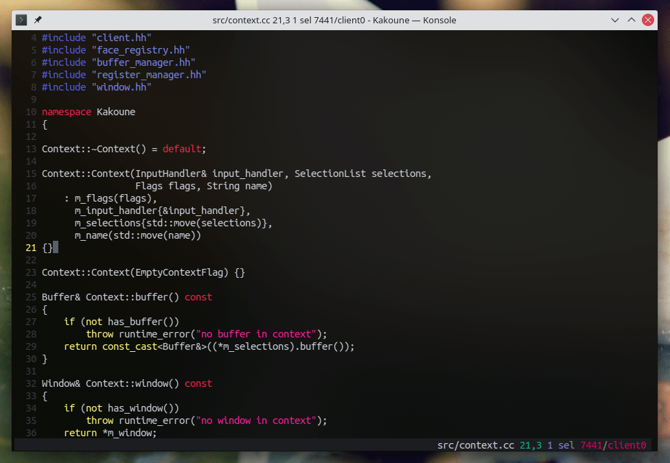
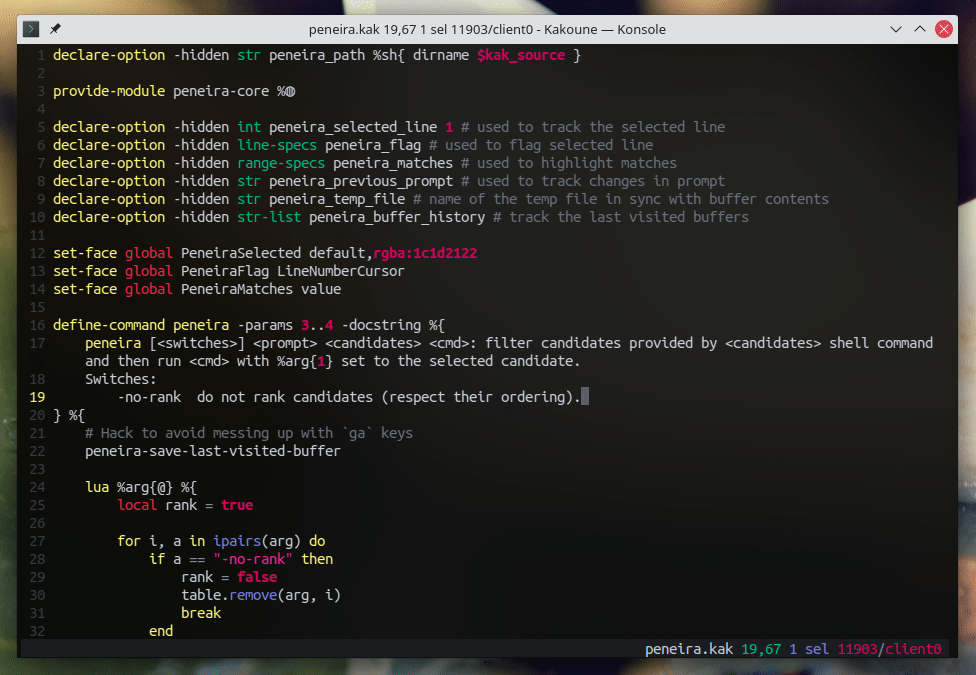

# Peneira

Peneira is a fuzzy finder for the [Kakoune](https://kakoune.org) editor. You can
use it to write custom filters for candidates lists. You can also use its built-in
filters, that allow you to select files in a directory, symbols in the
current document, an so on.



It depends on the [luar](https://github.com/gustavo-hms/luar) plugin. So make
sure you have it installed first.

## Highlights

### Multi-client support

Peneira opens its panel in the focused client, and can have many panels working
independently, one for each client.



### Multi-word search

You can search using multiple words separated by spaces. Each word matches from
the beginning of the line.



### It follows your colorscheme

**Palenight**:



**[Garbo](https://github.com/gustavo-hms/garbo)**:



**Solarized-light**:



## Writting your own filter

You can use the `peneira` command to write a filter for yourself. For instance,
here is a simple `buffers` filter to go to a buffer in the buffer list:

```kak
define-command buffers %{
    peneira 'buffers: ' %{ printf '%s\n' $kak_quoted_buflist } %{
        buffer %arg{1}
    }
}
```

The `peneira` command expects 3 arguments:

* a text to show in the prompt;
* a shell command that, when executed, will generate a list of candidates (one
  per line);
* a block of Kakoune commands to execute after the user has selected a line.

Inside the commands block, the `%arg{1}` expansion refers to the selected line.

By default, `peneira` ranks the candidates according to an internal score,
showing first the results it thinks the user intended. If you want that it respects
the candidates order instead, you can pass the `-no-rank` switch:

```kak
peneira -no-rank 'buffers: ' %{ printf '%s\n' $kak_quoted_buflist } %{
    buffer %arg{1}
}
```

## Built-in filters

Peneira also comes with predefined filters you can use at will.

### peneira-symbols

The `peneira-symbols` filter lists the symbols defined in the current file. You
can use it to quickly navigate in your code structure. It requires [Universal
Ctags](https://ctags.io) compiled with JSON support.



### peneira-lines

The `peneira-lines` filter lists lines in the current file. Use it to quickly go
to a specific line in your document.



### peneira-files

The `peneira-files` filter lists files in the current directory, recursively.

If the switch `-hide-opened` is passed, it ignores already opened files,
removing them from the candidates list.

By default, `peneira-files` uses [fd](https://github.com/sharkdp/fd) to get the list of files. You can change
that by editing `peneira_files_command` option, e.g.:

```kak
set-option global peneira_files_command "find ."
```

Or even

```kak
set-option global peneira_files_command "rg --files"
```

### peneira-local-files

The `peneira-local-files` filter works like `peneira-files`, except that it uses
the directory of the currently edited file as the root directory.


### peneira-mru

If you have [mru-files](https://gitlab.com/kstr0k/mru-files.kak) installed,
Peneira will detect it and automatically enable the `peneira-mru` filter, which
lists recently opened files in the subtree of the current working directory.
This way, you can easily jump to the most recently used files of the project you
are currently working on.

Hint: for this command to work best, try increasing the history size of the MRU plugin:

```kak
set-option global mru_files_max 100
```

## Installation

Remember peneira requires [luar](https://github.com/gustavo-hms/luar), so you must also install it. If you use
[plug.kak](https://github.com/andreyorst/plug.kak):

```kak
plug "gustavo-hms/luar" %{
    plug "gustavo-hms/peneira" %{
        require-module peneira
    }
}
```

Note that you need to require the `peneira` module for its commands to be
available.

## Performance tips

Peneira is fast. It should perform well in most cases. However, since everything
happens synchronously, you may experience performance issues on large candidates
list. If that's the case, try configuring Luar to use `luajit` instead:

```kak
set-option global luar_interpreter luajit
```

## Customization

Peneira follows your colorscheme, so it should fit well in your configuration.
But, if you want, you can customize some aspects of its appearance, but
overwriting the following faces:

* `PeneiraSelected`: used to highlight the selected line;
* `PeneiraFlag`: the appearance of the flag in the left side of the selected line;
* `PeneiraMatches`: used to highlight matched characters.
* `PeneiraFileName`: used to highlight the file name on `peneira-files` and `peneira-local-files`.

For example:

```kak
set-face global PeneiraMatches +ui
```

## Caveats

Peneira tries to remove line numbers when showing candidates, for a cleaner and
more immersive experience. But, due to how highlighters work on Kakoune, you must
name the `number-lines` highlighter (if you use it) _exactly_
`window/number-lines`, like so:

```kak
add-highlighter window/number-lines number-lines
```

Or, say:

```kak
add-highlighter window/number-lines number-lines -separator ' ' -hlcursor
```

Or even:

```kak
add-highlighter window/number-lines number-lines -separator ' ' -hlcursor -min-digits 3
```

The important thing is that it's named `window/number-lines`, otherwise peneira
won't be able to remove it.

## Third-party filters

You can find a selection of some custom filters implemented by Marko Bauhardt [here](https://codeberg.org/mbauhardt/peneira-filters).

## Acknowledgement

Many thanks to swarn for [porting the fzy algorithm to lua](https://github.com/swarn/fzy-lua).
