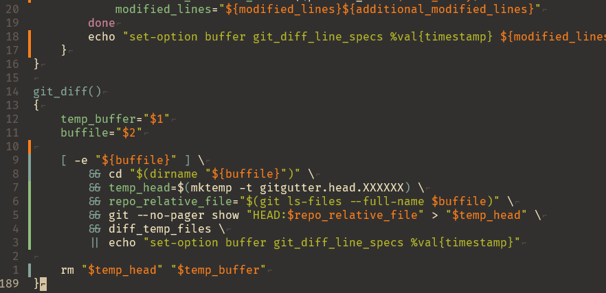

# simple-git-gutter.kak


The colors have been hard coded (sorry) to work with the value (orange), variable (green), function (blue) faces set by https://github.com/andreyorst/base16-gruvbox.kak

Logic has been copy pasted from https://github.com/airblade/vim-gitgutter

# Usage
```
plug-chain "andreyorst/plug.kak" noload \
plug "tom-huntington/simple-git-gutter.kak"
```
