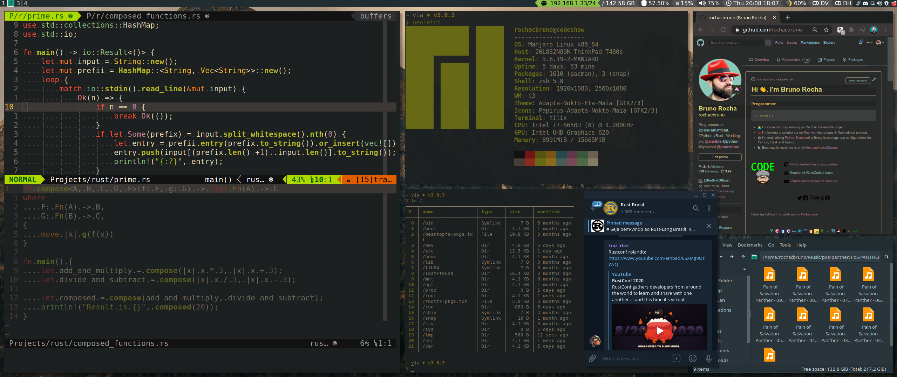
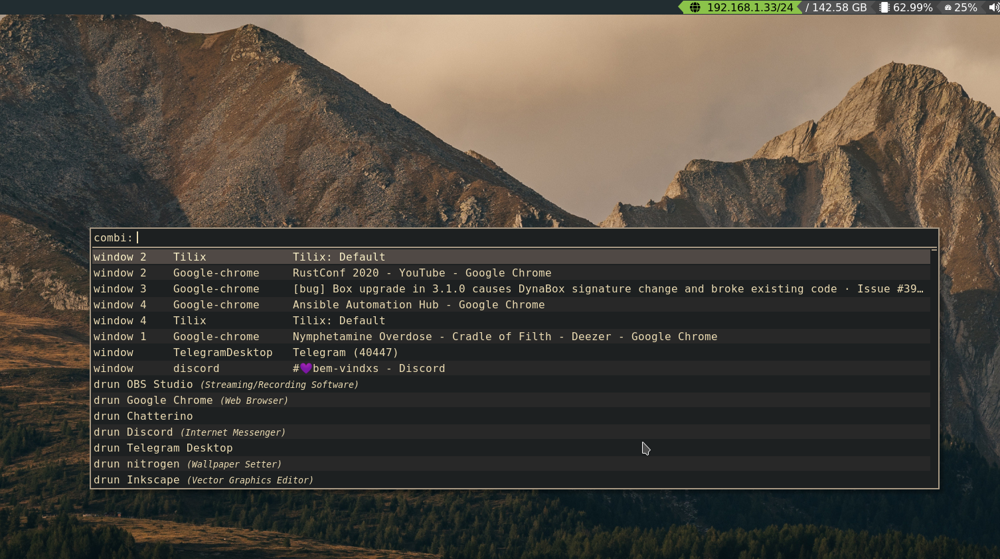

# i3-wm

* `A` Alt
* `C` Ctrl
* `W` Mod/Win
* `S` Shift
* `M1` Mouse left
* `M2` Mouse right
* `E` Enter
* `T` Tab

## Menus

* `A-F2` dmenu
* `W-d` dmenu Desktop apps
* `A-T` Rofi menu
* `W-z` Categorized Menu
* `W-C-b` Terminal based menu

## Workspaces

* `W-n` Go to workspace `n` (1-0)
* `W-x` Move workspace to second display
* `W-S-n` Move Window to workspace `n` and goto `n`
* `W-C-n` Move window to workspace `n` (stay in current)
* `W-C-(Right,Left,H,L)` Cycle workspaces
* `W-T` Cycle recent workspaces back and forth
* `W-S-T` Move current window to previous workspace and goto
* `W-S-n` Rename Worspace (Keep number e.g: `3:foo`)

## Windows

### Borders

* `W-u` Border None
* `W-y` Border 1
* `W-n` Border Normal

### Drag, Resize, Close

* `M1-W` Drag floating windows
* `M2-W` Resize windows
* `W-S-q` Kill/Close application
* `W-f` Full Screen

### Focus

* `W-Left(h)` Focus Window Left
* `W-Down(j)` Focus Window Down
* `W-Up(k)` Focus Window Up
* `W-Right(l)` Focus Window Right

### Movement

* `W-S-Left(h)` Move Window Left
* `W-S-Down(j)` Move Window Down
* `W-S-Up(k)` Move Window Up
* `W-S-Right(l)` Move Window Right

### Arrangement

* `W-S-z` Set Horizontal Split
* `W-S-v` Set Vertical Split
* `W-S-t` Split toggle
* `W-a` Focus Parent
* `W-S-a` Focus Child
* `W-S--(minus)` Hide on Scratchpad
* `W-S-+(plus)` Recover from Scratchpad (cycle)

### Layout

* `W-s` Stack
* `W-w` Tabbed
* `W-e` Split / Tile
* `W-S-Space` Toggle Floating Window
* `W-S-s` Toggle Stick Mode

## Launchers

* `W-E` Tilix terminal
* `W-F2` Google Chrome
* `W-F3` pcman File Manager
* `W-S-F3` pcman File Manager as root
* `W-C-F3` Ranger terminal file manager
* `W-F5` Audio Player Mocp
* `Print` Take a Screenshot (choose mode)
* `W-Print` Take whole window screenshot
* `W-S-Print` Take selection screenshot
* `W-C-x` Kill an app
* `W-F12` Slide down Guake Tilix Terminal
* `W-F6` Reveal Hidden Discord
* `W-F7` Reveal Hidden Telegram
* `W-F8` Reveal Hidden Chatterino2

## Layout

## Modes

### End

* `W-End` Enter End Mode
  * `l` Lock
  * `s` Suspend
  * `u` Switch User
  * `e` Logout
  * `h` Hibernate
  * `r` Reboot
  * `Shift-s` SHutdown

### Resize

* `W-r` Enter Resize Mode
  * `jhkl` or `Arrows`

### Gaps Resize

* `W-S-g` Enter Gaps Resize Mode
  * `o` Outer gaps, `i` Inner Gaps
  * Use 0, `-`, + (also Shift to apply to all windows)

## i3

* `W-m` Show/Hide status bar
* `C-S-A-l` Lock Screen
* `W-S-e` Exit i3wm
* `W-S-r` Restart i3
* `W-S-c` Reload config

> I3 Desktop with Tilix(nvim, nushell, neofetch), Browser and File Manager +  Floating Telegram

> Rofi application and utilities launcher

> i3 Status Rust (status bar implemented in Rust Language)

