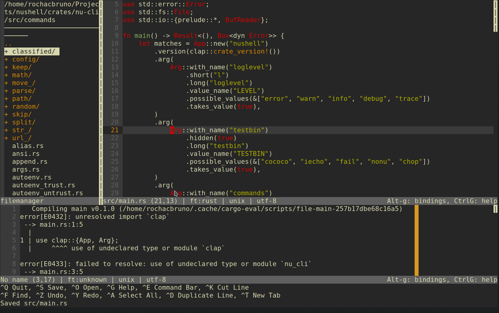

# Micro Editor

https://github.com/zyedidia/micro/blob/master/runtime/help/defaultkeys.md
https://github.com/zyedidia/micro/blob/master/runtime/help/commands.md
https://github.com/zyedidia/micro/blob/master/runtime/help/keybindings.md

## Commands

**Ctrl+E** to open command panel

- **replace** `replace 'search' 'value' 'flags'?`
- **replaceall** `replace 'search' 'new'`
- **run** `run sh-command`
- **vsplit** `vsplit filename` [opens right]
- **hsplit** `hsplit filename` [opens down]
- **tab** `tab filename` [opens new tab]
- **tabswitch** `tabswitch 1..` [switch to numbered tab]
- **textfilter** `textfilter 'sh-command'` [textfilter sort -n]

## Key Bindings

### General

- **Ctrl+r** - Toggle Line Numbers
- **Ctrl+e** - Command bar
- **Ctrl+f** - search
- **Ctrl+n** - next in search
- **Ctrl+p** - previous in search
- **Ctrl+g** - Help
- **Alt+g** - bindings
- **Alt+z** - Toggle Soft Wrap
- **Ctrl+l** - Goto line
- **Ctrl+b** - Shell
- **Ctrl+q** - quit

### File

- **Ctrl+s** - Save
- **Ctrl+o** - open
- **F3** - File Manager
- **F4** - Fzf

### Splits

- **Ctrl+'\\'** - Split Right
- **Ctrl+]** - Split Left
- **Alt+|** - New view same file on Right
- **Ctrl+w** - Switch split

### Tabs

- **Ctrl+T** - New Tab
- **Ctrl+Alt+>** - Next Tab
- **Ctrl+Alt+<** - Prev Tab

### Editing

- **Ctrl+c** - Copy
- **Ctrl+p** - Paste
- **Ctrl+x** - Cut
- **Ctrl+k** - Cut Line
- **Ctrl+z** - Undo
- **Ctrl+y** - Redo
- **Ctrl+d** - Duplicate line
- **Ctrl+a** - Select all
- **home** - Start of line
- **end** - End of line
- **Ctrl+home** - Doc start
- **Ctrl+end** - Doc end
- **Ctrl+Left** - Jump word left
- **Ctrl+Shift+Left** - Select word left
- **Ctrl+Right** - Jump word right
- **Ctrl+Shift+Right** - Select word right
- **Shift+home** - Select until start of line
- **Shift+end** - Select until end of line
- **Shift+Ctrl+Home** - Select ultil the home
- **Shift+Ctrl+End** - Select ultil the end
- **Alt+Up** - Move Line or selection UP
- **Alt+Down** - Move Line or selection DOWN
- **Alt+Backspace** - Delete word left
- **Alt j** - Join Lines in a single line

### Multi cursor

- **Ctrl+MouseLEft** - Apply multi cursors
- **Alt+n** - Apply multi-cursor for matched word
- **Alt-x** - Skip Multi-cursor for matched word
- **Alt-m** - Apply multi cursor at the beginning at selection lines
- **Alt+p / Alt+c** - Remove multicursor / Remove all
- **Alt+Shift+Up** - Add Multicursor Up
- **Alt+Shift+Down** - Add Multicursor Down

## init.lua commands

These are some custom commands added via `~/.config/micro/init.lua` [source](...)

- **Alt+b** - build (go run, cargo play, python3)
  This will run the current file in foreground and wait until you press any
  key to return back to the editing buffer.
- **Alt+o** - print output (go run, cargo play, python3)
  This will run the current file in foreground show output in new bottom panel
- **Alt+t** - Test (go test, cargo test, python3 -m pytest)
  This will run current file's test cases and wait any key to return.
- **Alt+f** - Format (go fmt, cargo fmt, black -l 79)
  This will format the current editing file, save it and reload it.
- **Alt+i** - Interact (rusti, ipython)
  Open current file in interactive mode on REPL
- **Alt+l** - Lint (clippy, flake8)
  Run Linters in the current file, give feedback in the same screen
- **Alt+y** - Sort imports (isort)

## Plugins

### Snippets

- **Alt-w** - snippets.Next
- **Alt-a** - snippets.Accept
- **Alt-s** - snippets.Insert
- **Alt-d** - snippets.Cancel

### Manipulator

Run the commands on the command bar **Ctrl+E**

 * `upper`: UPPERCASE
 * `lower`: lowercase
 * `reverse`: Reverses
 * `base64enc`: Base64 encodes
 * `base64dec`: Base64 decodes
 * `rot13`: ROT-13
 * `incNum`: Increase number by one
 * `decNum`: Decrease number by one
 * `capital`: Capitalize First Letter
 * `brace`: Adds brackets around selection
     * `curly`: Curly brackets (`{ }`)
     * `square`: Square brackets (`[ ]`)
	 * `angle`: Angle brackets (`< >`)
     * `dquote`: Double quotes (`" "`)
     * `squote`: Single quotes (`' '`)

