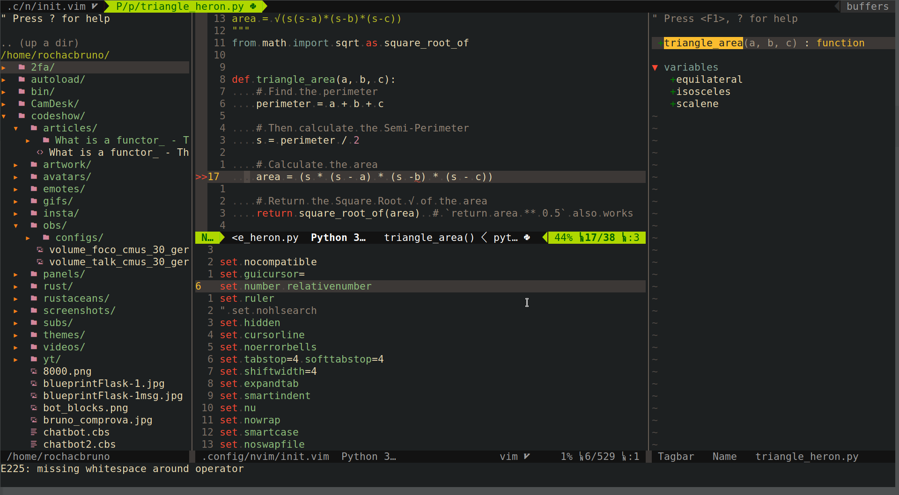
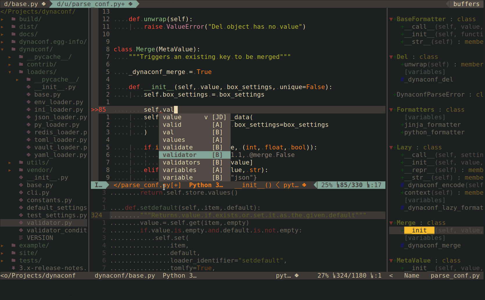
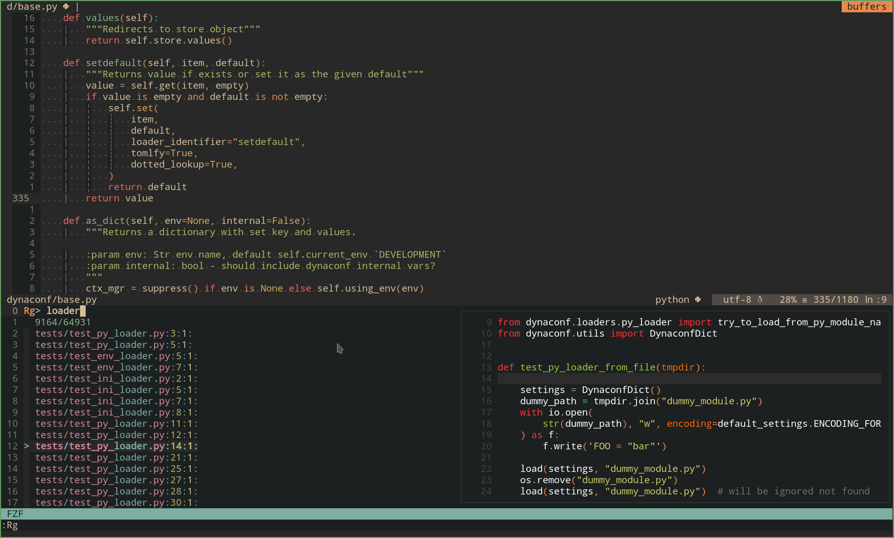

# VIM CheatSheet

Based on configuration provided in [.config/nvim/init.vim](./.config/nvim/init.vim)


## Glossary

- **Leader** = Leader Key, mapped to a single space " "
- **Alt** = Left Alt

## Idiom

- **Verbs** are actions such as **v** (visual), **c** (change), **y** (yank/copy),
  **d** (delete), **r** (replace), **p** (paste).
- **Modifiers** specifies regions such as **i** (inside), **a** (around), **t** (till),
  **f** (find).
- **Objects** are parts of the text such as **w** (word), **W** (WORD), **s** (sentence),
  **p** (paragraph), **b** (block), **t** (tag).


## Basic Usage

| Key         | Mode | Description |
| ----------- | ---- | ----------- |
| i | N | Enters Insert Mode |
| v | N | Enters Visual Mode |
| V | N | Enters Visual Line Mode |
| Esc | * | Get Back to Normal mode |
| :w | N | Write file |
| :x | N | Write and exit (ZZ) |
| :qa! | N | Quit not saving all buffers (ZQ) |
| . | N | Repeat last registered action |
| u | N | Undo |
| Ctrl-r | N | Redo |


## Movement

| Key         | Mode | Description |
| ----------- | ---- | ----------- |
| gg | N | File Home |
| G | N | File End |
| 5G | N | Go to line 5 |
| :-3 | N | Go to 3 alines above |
| b | N | Move to start of previous word |
| B | N | Move to start previous WORD |
| e | N | Move to end of next word |
| E | N | Move to end of next WORD |
| w | N | Move to start of next word |
| W | N | Move to start of next WORD |
| $ | N | Move to end of line |
| 0 | N | Move to start of line |
| % | N | Go to corresponding bracket |
| * | N | Go to next, prev # match of word |
| fa | N | Go to next letter a (, and ; navigates) |
| ta | N | Go to before of next letter a (, and ; navigates) |

> Tip: WORD is a word + ponctuation, F and T do backwards.


## Search


| Key         | Mode | Description |
| ----------- | ---- | ----------- |
| * | N | Search the cursor word |
| s/word/other | N | replaces 1st word in current line |
| s/word/other/g | N | replaces all word in current line |
| %s/word/other/g | N | replaces all word in whole file |
| 10,15s/word/other/g | N | replaces word on lines 10-15 |
| Leader-s | N | Search Current File |

## Text Manipulation


| Key         | Mode | Description |
| ----------- | ---- | ----------- |
| ggVG | N | Select all text |
| Yp | N | Duplicate Line |
| gcap | N | Comment whole paragraph |
| gcc | N | Comment the whole line |
| cs"' | N | Change surrounding " to ' |
| ds" | N |  Delete surrounding " |
| cst" | N | Change `<foo>` to `"foo"` |
| viwS" | N | Select and Surround with "quote" |
| ysiw" | N | Add surrounds to a word "foo" |
| I | N | Insert at start of the line |
| a | N | Insert after cursor |
| A | N | Insert at the end of the line |
| o | N | New line above |
| O | N | New line below |
| r | N | Replace Char |
| dl | N | Delete current Letter |
| cc | N | Replace line |
| cw | N | Replace to the end of workd |
| ciw | N | Replace the inner word |
| c$ | N | Replace to the end of word |
| ~ | N | Change char case, repeat with . |
| Ctrl-A | N | Increment a number |
| dd | N | Delete line |
| xx | N | Cut line |
| diw | N | Delete inside word |
| cis | N | Change inside sentence |
| ci" | N | Change inside quote |
| c/foo | N | Change until foo |
| ctX | N | Change until X |
| Alt-= | V | Assign value to a name it, move it then ESC. |
| S | N | Substitute the current line from the beginning |
| s | N | Enters substitute mode on current word |

## Text Selection and Copying


| Key         | Mode | Description |
| ----------- | ---- | ----------- |
| yy | N, V | Copy a line or selection |
| 5yy | N, V | Copy 5 lines |
| yw | N |  Copy a word |
| ye | N | Copy until the end of word |
| y$ | N | Copy to the end of the line |
| y2/foo | N | Copy until second foo |
| p | N |  Paste after cursor |
| Leader-p | N |  Paste the same thing multiple times |
| 4p | N |  Paste after cursor 4 times |
| P | N |  Paste before cursor |
| dd | N | Cut line |
| 3dd | N | Cut 3 lines |
| dw | N | Cut word |
| D | N | Delete to the end of line |
| d$ | N | Delete to the end of line |
| dt" | N | Delete to the next " |
| /s | N | Search |
| vap | N | Visual Select Around Paragraph |
| vib | N | Visual Select Inner Parentheses |
| dib | N | Delete Inner Parentheses |


## Visual mode

| Key         | Mode | Description |
| ----------- | ---- | ----------- |
| vi" | V | Select everything inner " |
| va" | V | Select everything including " |
| vi) | V | Select everything inner () " |
| v2i) | V | Select evertyhing inner 2 outer ) |

### Multi line edit


| Key         | Mode | Description |
| ----------- | ---- | ----------- |
| 0 Ctrl-v select I-- Esc | N | Enters block mode, selects all first columns, add -- |
| Ctrl-v select $ A-- Esc | N | Adds -- to the end of all lines |
| J | V | Join selected lines |
| gJ | V | Join selected block in a one liner |
| gS | V | Split selected line in 2 |
| < > | V | Indent |
| = | V | auto indent |


## Files

> Most commands support CTRL-T / CTRL-X / CTRL-V key bindings to open in a new
> tab, a new split, or in a new vertical split

| Key         | Mode | Description |
| ----------- | ---- | ----------- |
| Leader-pw | N | Rg search the current word |
| Leader-ps | N |Rg content search in current folder files |
| Leader-f | N | Open/Preview files in current folder |
| Leader-b | N | Open buffers preview |
| Leader-s | N | Search Current File with Preview |
| Leader-gf | N | Git Files |
| Leader-gt | N | Git Status |
| F3 | N | NERDTree |
| F4 | N | TagBar |
| Leader-e | N | Opens a file in the current dir |
| Leader-o | N | Opens a blank split |
| Leader-te | N | Opens a file in the current dir on a tab |
| Leader-prw | N | CocSearch current word on all buffers |
| Leader-ghw | N | Get Help for Word |
| :sav name | N | Save file as a new name, keep the original opened |


## Windows

| Key         | Mode | Description |
| ----------- | ---- | ----------- |
| Leader-z, L-x | N | Next/Previous Buffer |
| Leader-c | N | Close current buffer |
| Leader-q | N | Close current split (C-w-c) |
| Leader-o | N | Open new file in vertical (vnew) |
| Leader-] | N | New Horizontal Split |
| Leader-\ | N | New vertical split |
| Ctrl-w-n | N | New file on horizontal split |
| Ctrl-w-s | N | Split horizontal current file |
| Ctrl-w-v | N | Split vertically current file |
| Ctrl-w-w | N | Next Split |
| Ctrl-w-p | N | Prev Split |
| Ctrl-w-arrows | N | Move to split |
| Ctrl-w-hjkl | N | Jump to Split |
| Ctrl-w-g hjkl | N | Move windows |
| Ctrl-w-T | N | Move split to a tab (why?) |
| Ctrl-w->,< | N | Increase/DEcrease width |
| Ctrl-w-+,- | N | Increase/DEcrease height |
| Ctrl-w-q | N | Close Split and file |
| Ctrl-w-o | N |  Keep only current split |
| Ctrl-w-`|` | N | Maximize Vertical Split |
| Ctrl-w-_ | N | Maximize Horizontal Split |
| Ctrl-w-= | N | Restore split sizes |
| Ctrl-w-m | N | Maximize toggle current split |

## Code Analysis

| Key         | Mode | Description |
| ----------- | ---- | ----------- |
| Leader-gd | N | Go to definition |
| Leader-gy | N | Go to type definition |
| Leader-gi | N | Go to implementations |
| Leader-gr | N | Go to references |
| Leader-cr | N | Coc Restart |


## Utilities


| Key         | Mode | Description |
| ----------- | ---- | ----------- |
| Leader-u | N |  Undo tree |
| Leader-hf | N | File  History |
| Leader-hse | N | Search  History |
| Leader-hc | N | Commands  History |
| Leader-, | N |  Clear highlight (noh) |
| Leader-. | N |  Set working dir |
| Leader-g | N | Current line on git |
| Leader-gm | N | Show git message for current line |

## More

| Key         | Mode | Description |
| ----------- | ---- | ----------- |
| 100ifoo [ESC] | N | Will write "foo" 100 times |
| 100ifoo[ENTER][ESC] | N | Will write "foo" in 100 lines |
| 3. | N | Will write "foo" 3 times after above command |
| Leader-id | N |  Generates an UUID |


## Plugins

- `:DB` - manage databases
- `:DBUI` - manage databases in a buffer ui
- `:Clap` - Preview and search and preview colorscheme
- `:Leaders` - Show all leader mappings
- `:Bufferize` - Run a command and send output to a buffer
- `:Dispatch` - Run command in BG
- `:Black` - Format python code

* File System Changes
  * `:Delete`: Delete a buffer and the file on disk simultaneously.
  * `:Unlink`: Like `:Delete`, but keeps the now empty buffer.
  * `:Move`: Rename a buffer and the file on disk simultaneously.
  * `:Rename`: Like `:Move`, but relative to the current file's containing directory.
  * `:Chmod`: Change the permissions of the current file.
  * `:Mkdir`: Create a directory, defaulting to the parent of the current file.
  * `:Cfind`: Run `find` and load the results into the quickfix list.
  * `:Clocate`: Run `locate` and load the results into the quickfix list.
  * `:Lfind`/`:Llocate`: Like above, but use the location list.
  * `:Wall`: Write every open window.  Handy for kicking off tools like [guard][].
  * `:SudoWrite`: Write a privileged file with `sudo`.
  * `:SudoEdit`: Edit a privileged file with `sudo`.
  * File type detection for `sudo -e` is based on original file name.
  * New files created with a shebang line are automatically made executable.

## Tricks


### Sort

- Select lines in visual mode or use `%` for whole file
- `:sort` Sort Alphabetically
- `:sort!` Reverse order
- `:sort u` Remove duplicates
- `:sort n` Numeric wise sorting

### Removing sourrounding brackets w/o plugin

Having:

```python
{
  "foo": 1,
  "bar": 2,
}
```

Place the cursor inside the {} and type in normal mode: `di{va{p`

- `di{` cuts everything inside the brackets
- `va{` selects the empty brackets
- `p` replaces it with previously cut content


### Macro

qa record your actions in the register a.
Then @a will replay the macro saved into the register a
as if you typed it. @@ is a shortcut to replay the last executed macro.

#### Example

On a line containing only the number 1, type this:

- `qaYp<C-a>q` →
  - qa start recording.
  - Yp duplicate this line.
  - `<C-a>` increment the number.
  - q stop recording.
- @a → write 2 under the 1
- @@ → write 3 under the 2
- Now do 100@@ will create a list of increasing numbers until 103.

## References

- https://vim.rtorr.com/


> Nvim with File Navigator, TagBar and Python Editing + Linter



> Nvim with Python AutoComplete



> Nvim with Fuzzy Finder to open files (using ripgrep)


